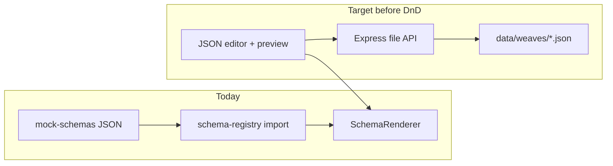
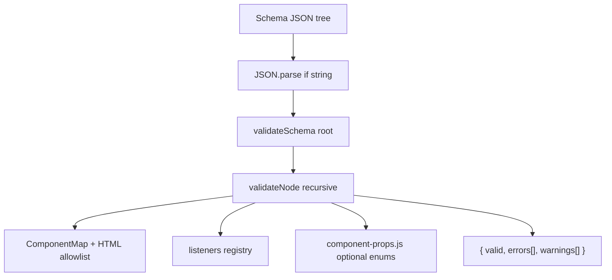

# Builder vs Backend: Recommended Path (Slow & Solo)

## Short answer

**Do not start with full drag-and-drop yet.**  
**Do not start with MongoDB/Postgres yet either.**

Start with a **small backend API that stores weaves/schemas as JSON files**, wire the app to load from it, then add a **JSON editor + live preview** (playground). Drag-and-drop comes after that, when you already know what JSON you are producing and where it is saved.

That matches your README order (v0.3 → v0.5 → v1.0) and fits learning + product goals without a deadline pressure.

---

## Where you are today

| Layer | Status |
|-------|--------|
| Renderer + Weaves + hash routing | Working ([`WeaveProvider`](src/weave/WeaveProvider.jsx), [`SchemaRenderer`](src/weave/SchemaRenderer.jsx)) |
| Schemas | Static imports in [`schema-registry.js`](src/weave/schema-registry.js) — not loaded from server |
| Backend | Only [`/api/ping`](src/server.js) and [`/api/ai`](src/server.js) |
| Builder | **No code** — only [`src/builder/mock-schemas/`](src/builder/mock-schemas/) JSON files |
| Drag-and-drop | Planned v1.0 only |



---

## Why not drag-and-drop first?

DnD is the **hardest** slice of v1.0:

- Component palette, canvas tree, selection, props panel
- Serializing React tree → your JSON node shape (`type`, `props`, `children`, `listeners`)
- Undo/redo, nesting rules (Page → Main → Section, compound `Card.Header`, etc.)

Without save/load, you only get **export JSON to clipboard** — fine for a weekend experiment, but weak as a framework you grow over time.

You just solved a related lesson with `showModal`: **dynamic UI needs React state, not mutating imported JSON.** The builder will hit the same class of problems at scale.

---

## Why not full DB first?

For solo learning + slow pace, a database adds:

- Schema migrations, connection config, deployment
- Auth (if multi-user later)
- ORM/query layer before you even know your API shape

**Better first step:** file-backed API (same JSON you already hand-author).

| Stage | Storage | When to upgrade |
|-------|---------|-----------------|
| **Now** | JSON files on disk (`data/weaves/app/...`) | Solo dev, local machine |
| **Later** | SQLite (single file, SQL practice) | Want queries/versioning without server setup |
| **Much later** | Postgres or Mongo | Multi-user, hosted product, auth |

---

## Recommended sequence (smooth, no timeline)

### Step 1 — Close small v0.2 gaps (optional but cheap)

Before new systems, quick wins that make schemas trustworthy for a builder:

- Schema validation (JSON Schema or a small `validateNode()`)
- Document listener + node shape in README (you already use `openModal`, `setTheme`, `loadSchema`)
- Fix stale README items (Modal trigger, Icon — verify current code)

**Why:** whatever generates JSON (editor or DnD) needs validation feedback.

---

### Step 2 — Minimal weave/schema API (v0.3 lite)

Extend [`src/server.js`](src/server.js) with file storage — **no DB**.

Suggested routes:

```
GET  /api/weaves              → list manifests
GET  /api/weaves/:weaveId     → app.weave.json + schema list
GET  /api/weaves/:weaveId/schemas/:schemaId  → one schema tree
PUT  /api/weaves/:weaveId/schemas/:schemaId  → save schema JSON
POST /api/weaves              → create weave (optional)
```

On disk, mirror what you have now:

```
data/
  weaves/
    app/
      weave.json
      landing.schema.json
      components.schema.json
      search.schema.json
```

**Frontend change:** teach [`resolveWeave`](src/weave/resolveWeave.js) / [`App.jsx`](src/App.jsx) to fetch weave from API in dev, with fallback to bundled mock-schemas if API is down.

**What you learn:** REST design, separation of runtime JSON from repo files, save/load loop.

---

### Step 3 — JSON playground (v0.5, before DnD)

New route `#/builder` or separate dev page:

- Left: textarea or CodeMirror/Monaco editing JSON
- Right: live [`SchemaRenderer`](src/weave/SchemaRenderer.jsx) preview
- Buttons: **Validate**, **Save to API**, **Export file**

**What you learn:** schema editing UX, error handling, preview sync — 80% of builder value with 20% of DnD complexity.

This is the best “smooth and slow” step: you can manually craft schemas, save them, reload them, and see mistakes immediately.

---

### Step 4 — Drag-and-drop builder MVP (v1.0)

Only after Steps 2–3:

```
Palette → Canvas (tree) → Props panel → generates JSON → Save via API
```

Suggested MVP scope (keep it small):

- Layouts: `Page`, `Main`, `Section`
- UI: `Button`, `Text` (h1/p), `Card`, `Input`
- Props panel for `variant`, `label`, `className`
- No listeners editor in v1 — add in v1.1

Libraries to evaluate when you reach this step: `@dnd-kit/core` (modern, flexible) or `react-dnd`.

**What you learn:** tree state, serialization, builder architecture.

---

## What I would skip for now

- MongoDB/Postgres until you need multi-user or hosted deploy
- Rust `.wv` compiler (parallel track; not blocking builder)
- Full auth
- Undo/redo in first DnD version

---

## Decision summary

| Option | Verdict for your goals |
|--------|------------------------|
| **Drag-and-drop now** | Fun, but no persistence story; rework later |
| **Full DB + backend now** | Too much infra before API shape is proven |
| **File API → playground → DnD** | Best fit: learn incrementally, each step is usable |

---

## Suggested first implementation task (when you are ready)

1. Add `data/weaves/app/` and copy current mock-schemas there
2. Implement `GET/PUT` schema routes in [`src/server.js`](src/server.js)
3. Add `fetchWeave()` in [`src/weave/`](src/weave/) and load in dev
4. Add `#/playground` schema with JSON editor + preview + Save button

After that works end-to-end once, drag-and-drop becomes “UI that writes the same JSON you already save” — much clearer problem.

---

## Schema validation design (`validateNode`) — explain before building

The plan uses a **Weavo-specific validator**, not a full JSON Schema document for every component on day one. Reason: your renderer already defines the contract in code ([`renderer.jsx`](src/schema-renderer/renderer.jsx), [`ComponentMap`](src/components/index.jsx), [`listeners.js`](src/js/listeners.js)). Validation should mirror that contract and give **paths** (e.g. `$.children[2].props.listeners.onClick`) for the playground editor.

### What we are NOT doing first

- Full **JSON Schema** with per-prop types for all 22 components — high maintenance, duplicates ComponentMap
- Strict **parent/child composition rules** on v1 — start as warnings, not hard errors
- Runtime validation on every render — only on **Validate**, **Save**, and optional pre-preview in playground

### Architecture



**New file:** [`src/schema-renderer/validate-schema.js`](src/schema-renderer/validate-schema.js)

```javascript
validateSchema(tree)   // entry: root must be Page (warning if not)
validateNode(node, path) // recursive core
validateListeners(listeners, path)
validateWeave(manifest)  // later: weave.json shape
```

Shared by: playground **Validate** button, `PUT /api/.../schemas/:id` (reject 400 if invalid), future DnD “can drop here?” checks.

### Layer 1 — Structural (errors)

Every node walk checks:

| Rule | Example failure |
|------|-----------------|
| Leaf text | `"hello"` — valid, stop |
| Object node must have string `type` | `{ "props": {} }` |
| `props` / `styles` / `listeners` must be plain objects if present | `"props": "x"` |
| `children` must be `string`, object, array, or absent | `"children": 123` |
| Array children: each item validated recursively | bad nested node |

Path format: JSON Pointer style — `$`, `$.children[0]`, `$.children[1].props.listeners.onClick`.

### Layer 2 — Type resolution (errors)

Same logic as renderer line 16:

```javascript
const Component = ComponentMap[type] || type;
```

| Check | Result |
|-------|--------|
| `type` in `ComponentMap` | OK |
| `type` in HTML allowlist (`div`, `span`, `h1`–`h6`, `p`, `a`, `strong`, `button`, …) | OK |
| Otherwise | **error** `UNKNOWN_TYPE` |

This catches typos like `"Buton"` or `"Iconn"` before render silently falls through to invalid DOM tag.

### Layer 3 — Listeners (errors)

Listeners may live at **node root** or inside **`props.listeners`** (renderer merges both).

For each `onClick`, `onChange`, etc.:

1. Key must be a known React prop name (`onClick`, `onChange`, `onSubmit`, `onFocus`, `onBlur`) — see [`event-handlers.js`](src/js/event-handlers.js)
2. Value forms (same as `resolveListener`):
   - string → `"alert"`
   - object → `{ "handler": "loadSchema", "schema": "landing" }` or legacy `{ "type": "navigate", "to": "..." }`
3. Resolved handler name **must exist** in [`listeners.js`](src/js/listeners.js) — error `UNKNOWN_HANDLER`

Optional payload checks (warnings first, errors later):

- `loadSchema` without `schema` / `schemaId` / `to` → warning
- `setTheme` without theme value (OK for RadioGroup — runtime reads event) → skip or info

### Layer 4 — Component props (warnings → errors over time)

Small optional registry [`src/schema-renderer/component-props.js`](src/schema-renderer/component-props.js):

```javascript
export const COMPONENT_PROPS = {
  Button: {
    variant: { enum: ["primary", "secondary", "default"] },
    size: { enum: ["sm", "md", "lg"] },
  },
  Badge: { variant: { enum: ["primary", "success", "warning", "info", "danger"] } },
  // grow incrementally as builder adds props panel fields
};
```

- Unknown prop on a known component → **warning** `UNKNOWN_PROP` (React still accepts arbitrary props)
- Known prop with wrong enum → **error** `INVALID_PROP_VALUE`
- Do **not** require every prop — only validate when present

### Layer 5 — Composition hints (warnings only, v1)

Soft rules, not blockers:

- `Modal.Header` / `Modal.Body` / `Modal.Footer` not under `Modal` → warning
- `Tabs.Tab` not under `Tabs.TabList` → warning
- Root schema node should be `Page` → warning if `Section` at root

These help the builder later without rejecting hand-authored schemas that still render.

### Return shape

```javascript
{
  valid: false,           // true iff errors.length === 0
  errors: [
    {
      path: "$.children[0].children[3].type",
      code: "UNKNOWN_TYPE",
      message: "Unknown component type \"Buton\""
    }
  ],
  warnings: [
    {
      path: "$.children[0].props.unknownFlag",
      code: "UNKNOWN_PROP",
      message: "Button has unknown prop \"unknownFlag\""
    }
  ]
}
```

Playground UI: red list for errors, yellow for warnings; clicking a row could jump cursor to path (nice-to-have).

### Where validation runs

| Place | Behavior |
|-------|----------|
| Playground **Validate** | Show errors/warnings; still allow preview if you want (or block preview on errors — your choice) |
| `PUT /api/weaves/:id/schemas/:schemaId` | **Reject 400** with `{ errors, warnings }` if `valid === false` |
| DnD builder (later) | Call `validateNode` after each drop; inline field errors from props registry |

### Phased rollout (matches slow pace)

**Phase A (minimal, build first):** Layers 1–3 only — structure, type, listeners. ~150 lines, no prop registry.

**Phase B:** Add `component-props.js` enums for Button, Badge, Modal, RadioGroup.

**Phase C:** Weave manifest validation (`validateWeave`) — ids match files, `default` exists.

**Phase D (optional):** Generate a JSON Schema **meta-schema** from the same registries for external tooling — not hand-maintained twice.

### Why this fits Weavo better than JSON Schema alone

- Handlers are **Weavo-specific** (`loadSchema`, `openModal`) — generic JSON Schema cannot express “must be key in listeners object” without custom keywords
- Renderer already **falls back to HTML tags** — validator must share that allowlist
- Solo pace: Phase A gives immediate value in playground/API with little upkeep; expand registry as builder props panel grows

