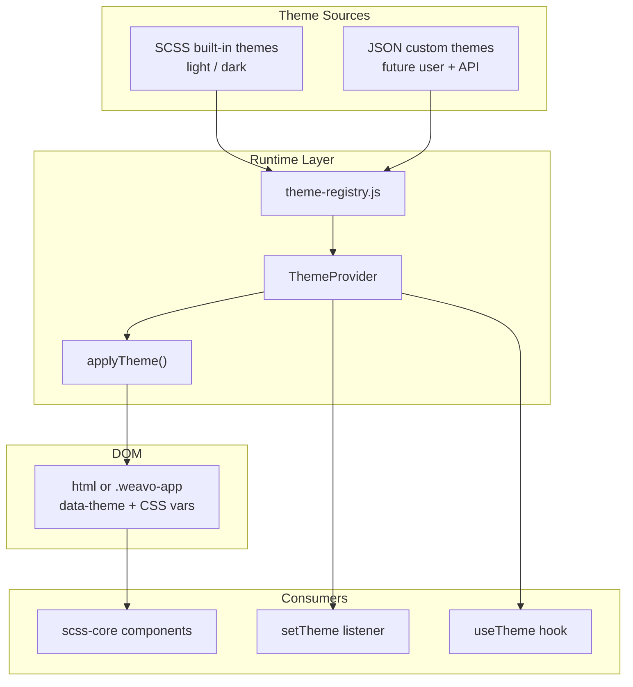
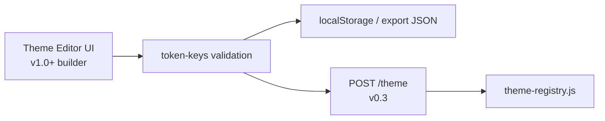

# Weavo Theming System Architecture

## Goal

Enable **runtime theme switching** now (light/dark), with a clear path for **user-created themes later** (not in this phase). Align with Weavo’s existing CSS-variable foundation in [`src/scss-core/_variables.scss`](src/scss-core/_variables.scss) and the Weave/schema architecture.

---

## Current State

- ~230 tokens live on `:root` in [`_variables.scss`](src/scss-core/_variables.scss) — single light palette only
- All SCSS (`ui.scss`, `layout.scss`, `landing.scss`) consumes `var(--*)` — **no refactor of component styles needed**
- No `theme-system/` module, no `ThemeProvider`, no persistence
- README v0.3 already plans `POST/GET /theme` — theme JSON should match that API shape

---

## Design Principles

1. **CSS variables are the runtime contract** — components never read theme IDs directly; they read tokens
2. **Three token tiers** — primitives → semantic → component (component tier already exists)
3. **Hybrid source of truth** — SCSS for built-in themes; JSON for custom/user themes (future)
4. **Theme is global, separate from Weave** — schema routing and visual theme are orthogonal (like Frappe desk theme vs form)
5. **Schema-friendly** — expose `setTheme` listener + optional `useTheme()` for React; no theme editor yet

---

## Architecture Overview



---

## Token Model (3 tiers)

| Tier | Purpose | Example | Where defined |
|------|---------|---------|---------------|
| **Primitive** | Raw palette values | `--color-primary: #4f46e5` | Per-theme SCSS block or JSON |
| **Semantic** | UI meaning | `--color-bg`, `--color-text` | References primitives |
| **Component** | Widget-specific | `--btn-primary-bg`, `--card-shadow` | References semantic (already in `_variables.scss`) |

**Refactor (minimal):** Split [`_variables.scss`](src/scss-core/_variables.scss) into:

- `_tokens.scss` — shared non-color tokens (spacing, radius, typography, shadows structure)
- `_theme-light.scss` — `:root, [data-theme="light"]` color + surface overrides
- `_theme-dark.scss` — `[data-theme="dark"]` overrides only (dark palette)

Component tokens (`--btn-*`, `--card-*`, etc.) stay as `var(--color-*)` chains so **dark mode only overrides primitives/semantic layer**.

---

## Built-in Themes (Phase 1 — implement)

Ship two themes:

| ID | Label | Mechanism |
|----|-------|-----------|
| `light` | Light | Default; current `:root` values |
| `dark` | Dark | `[data-theme="dark"]` block with inverted surfaces + adjusted contrast |

**Apply on:** `document.documentElement` (or `.weavo-app` wrapper):

```html
<html data-theme="dark">
```

**Persistence:** `localStorage` key `weavo.theme` (default `light`).

---

## JSON Theme Format (Phase 2 — define now, implement later)

Reserve format for user themes + v0.3 API. Example:

```json
{
  "id": "ocean",
  "name": "Ocean",
  "version": 1,
  "extends": "light",
  "tokens": {
    "--color-primary": "#0284c7",
    "--color-primary-hover": "#0369a1",
    "--color-bg": "#0f172a",
    "--color-text": "#f8fafc"
  }
}
```

Rules for future implementation:

- `extends` — optional base theme (`light` | `dark` | theme id)
- `tokens` — flat map of CSS custom property names → values
- Validation — whitelist keys against [`THEME_TOKEN_KEYS`](src/theme-system/token-keys.js) (generated from `_tokens.scss` list or maintained manifest)
- `applyTheme()` merges: base theme → extends chain → custom tokens → inject via `style.setProperty` on root

This mirrors how Weavo already treats UI as **declarative JSON**.

---

## Runtime Module: `src/theme-system/`

Proposed files:

| File | Role |
|------|------|
| [`ThemeProvider.jsx`](src/theme-system/ThemeProvider.jsx) | React context; wraps app inside or alongside `WeaveProvider` |
| [`useTheme.js`](src/theme-system/useTheme.js) | `{ themeId, setTheme, themes, isDark }` |
| [`theme-registry.js`](src/theme-system/theme-registry.js) | Built-in theme metadata + JSON theme loader (stub for custom) |
| [`apply-theme.js`](src/theme-system/apply-theme.js) | Sets `data-theme`, applies JSON overrides, persists |
| [`token-keys.js`](src/theme-system/token-keys.js) | Allowed CSS var names for validation (future) |
| [`themes/light.scss`](src/scss-core/themes/_light.scss) | Light primitives (extracted from current `:root`) |
| [`themes/dark.scss`](src/scss-core/themes/_dark.scss) | Dark overrides |

### Provider stack in [`App.jsx`](src/App.jsx)

```jsx
<ThemeProvider defaultTheme="light">
  <WeaveProvider weave={weave}>
    <div className="App weavo-app">
      <SchemaRenderer />
    </div>
  </WeaveProvider>
</ThemeProvider>
```

`ThemeProvider` runs once at boot: read `localStorage` → `applyTheme(id)`.

### `useTheme()` API

```js
const { themeId, setTheme, themes, resolvedTokens } = useTheme();
setTheme("dark");
```

### Schema integration

Add to [`listeners.js`](src/js/listeners.js):

```js
setTheme(_event, payload, context) {
  context.setTheme?.(payload.theme ?? payload.themeId);
}
```

Pass `setTheme` from `ThemeProvider` through renderer context (same pattern as `setActiveSchema` in [`SchemaRenderer.jsx`](src/weave/SchemaRenderer.jsx)).

Optional schema-driven toggle (no custom component needed initially):

```json
{
  "type": "Button",
  "props": { "label": "Dark mode", "variant": "secondary" },
  "listeners": {
    "onClick": { "handler": "setTheme", "theme": "dark" }
  }
}
```

---

## Future: User Theme Creation (Phase 3 — not now)

Document-only in architecture; no UI this sprint.



Capabilities to plan for:

- **Import/export** — download `.theme.json`, load from file
- **Live preview** — `applyTheme` with draft tokens before save
- **Publish** — save to backend; weave manifest references `theme: "ocean"` (future weave field)
- **CLI** — `weavo generate theme ocean` (v0.4)

---

## Integration with Weave (future optional)

Extend [`app.weave.json`](src/builder/mock-schemas/app.weave.json) later:

```json
{
  "id": "app",
  "default": "landing",
  "theme": "light",
  "schemas": { ... }
}
```

Weave-level default theme; user override still wins via `localStorage`.

---

## Implementation Phases

### Phase 1 — Switch built-in themes (recommended next build)

- Split SCSS into light/dark theme partials
- Add `theme-system/` with `ThemeProvider`, `applyTheme`, `useTheme`
- Wire `App.jsx`, `setTheme` listener, localStorage
- Add theme toggle to landing topbar schema (optional polish)

### Phase 2 — JSON custom themes

- Define JSON schema / TypeScript JSDoc types for theme files
- Implement `registerTheme(json)` + validation against `token-keys`
- Load custom themes from `src/themes/` or API

### Phase 3 — User creation + API

- Theme editor in builder
- `POST/GET /theme` persistence (v0.3)
- Export/import, weave default theme

---

## Files to Touch (Phase 1 only)

| File | Change |
|------|--------|
| [`src/scss-core/_variables.scss`](src/scss-core/_variables.scss) | Split shared + import theme partials |
| **New** `src/scss-core/themes/_light.scss`, `_dark.scss` | Primitive/semantic color tokens |
| **New** `src/theme-system/*` | Provider, registry, apply, hook |
| [`src/App.jsx`](src/App.jsx) | Wrap with `ThemeProvider` |
| [`src/weave/SchemaRenderer.jsx`](src/weave/SchemaRenderer.jsx) | Pass `setTheme` in renderer context |
| [`src/js/listeners.js`](src/js/listeners.js) | Add `setTheme` handler |
| [`README.md`](README.md) | Theme architecture + usage docs |

---

## Out of Scope (this plan)

- Theme editor UI
- API persistence
- Per-schema theme (only global for now)
- System `prefers-color-scheme` auto-detect (can add as optional `theme: "system"` later)

---

## Success Criteria (Phase 1)

- User can switch `light` ↔ `dark` without page reload
- Choice persists across refresh
- All 21 components + landing page look correct in dark mode
- `weavo.setTheme("dark")` works from schema listener
- JSON theme format documented for future user themes
