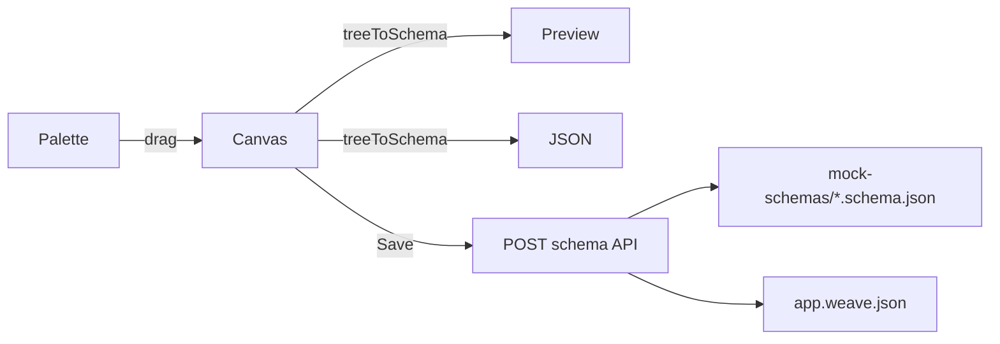

# Weavo

**Dynamic SCSS + React + JSON Schema UI Framework**

[GitHub](https://github.com/Anurag810/weavo)
[License: GPL-3.0](LICENSE)

---

## Current Status

Weavo is an early-stage, schema-driven UI framework. The app renders entirely from JSON via the **Weave** system — three production-style schemas (`landing`, `components`, `search`) grouped in `app.weave.json`.


| Milestone                    | Progress | Summary                                                                             |
| ---------------------------- | -------- | ----------------------------------------------------------------------------------- |
| **v0.1** — SCSS + components | ~98%     | CSS-variable theming, light/dark themes, 21 components, polished SCSS               |
| **v0.2** — Schema renderer   | ~92%     | Recursive renderer, Weaves, hash routing, validation, `openModal`, event listeners |
| **v0.3** — Backend API       | ~15%     | Express + Ollama AI endpoints; schema/theme storage not started                     |
| **v0.4** — CLI               | ~25%     | `dev`, `build`, `setup-requirements` only                                           |
| **v0.5** — Docs + playground | ~40%     | Drag-and-drop playground at `#/playground` with live preview, validation, JSON view |
| **v1.0** — Builder MVP       | ~35%     | Palette, nested canvas, props panel, and save-to-disk schemas                       |


## Recent Progress


| Area                       | Status  | Details                                                                                              |
| -------------------------- | ------- | ---------------------------------------------------------------------------------------------------- |
| **Theme system**           | Done    | `ThemeProvider`, light/dark switching, `localStorage`, `setTheme` listener                           |
| **Weave system**           | Done    | `WeaveProvider`, `SchemaRenderer`, `app.weave.json`, hash routing, `loadSchema` listener             |
| **Schema registry**        | Done    | `src/weave/schema-registry.js` maps filenames → imported JSON                                        |
| **Event listeners**        | Done    | Root + props `listeners`; handlers: `loadSchema`, `setTheme`, `openModal`, `closeModal`, etc. |
| **Schema validation**      | Done    | `validate-schema.js` — structure, types, listeners; runs before render in `SchemaRenderer`   |
| **Landing page**           | Done    | Full marketing site from built using Weavo. `landing.schema.json` (features, roadmap, FAQ, showcase) |
| **Component library page** | Done    | `components.schema.json` — buttons, cards, tabs, accordion, modal, spinners                          |
| **AI assistant page**      | Done    | `search.schema.json` — chat UI Preview page                                                          |
| **Dev console events**     | Planned | `weavo.on` / debug logging — deferred                                                                |


### Active routes


| Hash           | Schema                   | Description                      |
| -------------- | ------------------------ | -------------------------------- |
| `#/landing`    | `landing.schema.json`    | Product landing page (default)   |
| `#/components` | `components.schema.json` | Component library showcase       |
| `#/search`     | `search.schema.json`     | AI assistant interface (preview) |


---

## Vision

A full-stack, dynamic UI framework with the following goals:

- SCSS-based theming that uses **CSS variables and tokens**, not hardcoded values
- A **React component library** connected to the SCSS system
- **Serialize UI structure into JSON** for cross-platform rendering (web → mobile)
- **Render JSON schemas back into React**, with future export to iOS/Android
- A **drag-and-drop builder** for no-code/low-code UI creation
- **Backend support** via Express (Node.js) with optional FastAPI; schema/theme storage planned

---

## Quick Start

```bash
git clone https://github.com/Anurag810/weavo.git
cd weavo
npm install   # or pnpm install

npm run dev   # http://localhost:5173
```

Production build:

```bash
npm run build   # output → dist/
```

Optional — start the Express backend (Ollama AI):

```bash
npm run serve   # http://localhost:3000
```

---

## CLI Commands

Weavo ships with a CLI at `bin/weavo.js`.

```bash
npx weavo <command>
```


| Command                    | Description                                         |
| -------------------------- | --------------------------------------------------- |
| `weavo setup-requirements` | Install Rust, wasm-pack, and build WebAssembly deps |
| `weavo dev`                | Start the Vite dev server (uses pnpm)               |
| `weavo build`              | Build the app for production                        |


### npm scripts


| Script                             | Description                             |
| ---------------------------------- | --------------------------------------- |
| `npm run dev`                      | Start Vite dev server                   |
| `npm run build`                    | Production build                        |
| `npm run preview`                  | Preview production build                |
| `npm run lint`                     | Run ESLint                              |
| `npm run serve`                    | Start Express backend (`src/server.js`) |
| `npm run test`                     | Run AI smoke test (`src/tests/`)        |
| `npm run weavo setup-requirements` | Same as `weavo setup-requirements`      |


---

## Project Structure

```
weavo/
├── bin/weavo.js              # CLI entry point
├── Cargo.toml                # Rust/WASM compiler config (source not yet implemented)
├── src/
│   ├── App.jsx               # Loads app weave + renders via SchemaRenderer
│   ├── main.jsx              # React bootstrap
│   ├── server.js             # Express backend (AI endpoints)
│   ├── scss-core/            # CSS-variable tokens + component styles
│   │   ├── _variables.scss   # Shared + component tokens
│   │   ├── themes/           # _light.scss, _dark.scss color palettes
│   │   ├── app.scss          # SCSS entry
│   │   ├── layout.scss       # Layout + flex/grid utilities
│   │   ├── ui.scss           # UI component styles
│   │   └── landing.scss      # Landing page styles
│   ├── components/
│   │   ├── layouts/          # Page, Header, Footer, Sidebar, Main, Section, Navbar, Container
│   │   ├── ui/               # Button, Input, Card, Modal, Tabs, etc.
│   │   ├── withWeavoLayout.jsx
│   │   └── index.jsx         # ComponentMap registry
│   ├── weave/                # Weave system — multi-schema groups + routing
│   │   ├── WeaveProvider.jsx
│   │   ├── SchemaRenderer.jsx
│   │   ├── resolveWeave.js
│   │   └── schema-registry.js
│   ├── theme-system/         # ThemeProvider, apply-theme, registry, token keys
│   │   ├── ThemeProvider.jsx
│   │   ├── apply-theme.js
│   │   ├── theme-registry.js
│   │   └── token-keys.js
│   ├── schema-renderer/
│   │   ├── renderer.jsx      # JSON → React recursive renderer
│   │   ├── validate-schema.js # validateSchema / validateNode (structure, types, listeners)
│   │   └── ai-models/        # Ollama integration (WeavoAI)
│   ├── js/
│   │   ├── event-handlers.js # Listener binding for schema events
│   │   └── listeners.js      # Handler registry (alert, navigate, callAI, etc.)
│   ├── builder/
│   │   └── mock-schemas/     # Application schemas + .wv DSL sample
│   └── tests/                # Manual AI smoke test
├── public/                   # Static assets
├── package.json
├── vite.config.js
└── README.md
```

**Planned but not yet present:** `targets/`, `backend/` (separate package), `docs/`, `examples/`, Rust source files, user theme editor.

---

## Architecture

```
index.html → main.jsx → App.jsx → ThemeProvider → WeaveProvider → SchemaRenderer → renderNode(schema)
                                                                                        ↓
                                                                                  ComponentMap → React DOM
                                                                                        ↑
                                                                                  app.scss (theming via data-theme)
```

The app loads a **Weave** (group of schemas) and a **Theme** (light/dark). Themes apply via `data-theme` on `<html>`; choice persists in `localStorage` (`weavo.theme`).

---

## Weaves — Multi-Schema Groups

A **Weave** is a named collection of related schemas. Terminology:


| Term                 | Meaning                                                 |
| -------------------- | ------------------------------------------------------- |
| **Schema**           | One JSON UI tree (a single screen)                      |
| **Weave**            | A group of schemas (e.g. landing + components + search) |
| **Loom** *(planned)* | Top-level project/workspace containing weaves           |


### Weave manifest (`app.weave.json`)

```json
{
  "id": "app",
  "name": "Weavo",
  "default": "landing",
  "schemas": {
    "landing": { "title": "Landing Page", "file": "landing.schema.json" },
    "components": { "title": "Component Library", "file": "components.schema.json" },
    "search": { "title": "AI Assistant", "file": "search.schema.json" }
  }
}
```

Register new schema files in `src/weave/schema-registry.js`, then reference them in a weave manifest.

### Switching schemas

**Hash routing** — link to `#/components`, `#/search`, `#/landing`

**Listener** — bind `loadSchema` on any button:

```json
{
  "type": "Button",
  "props": { "label": "Open Components", "variant": "primary" },
  "listeners": {
    "onClick": { "handler": "loadSchema", "schema": "components" }
  }
}
```

**Dynamic modal** — bind `openModal` (rendered via `WeaveProvider.showModal`, not by mutating JSON):

```json
{
  "type": "Button",
  "props": { "label": "Open dialog", "variant": "secondary" },
  "listeners": {
    "onClick": {
      "handler": "openModal",
      "header": "Title",
      "body": "Message body",
      "footer": [
        { "type": "Button", "props": { "label": "Close", "variant": "secondary" },
          "listeners": { "onClick": { "handler": "closeModal" } } }
      ]
    }
  }
}
```

---

## JSON Schema Format

```json
{
  "type": "Button",
  "props": {
    "label": "Submit",
    "variant": "primary",
    "className": "extra-class",
    "listeners": {
      "onClick": { "handler": "alert", "message": "Button clicked!" }
    }
  },
  "styles": {
    "padding": "16px",
    "color": "var(--color-primary)"
  },
  "children": "Click me"
}
```


| Field       | Description                                                                |
| ----------- | -------------------------------------------------------------------------- |
| `type`      | Component name from `ComponentMap`, or an HTML tag (`"div"`, `"h1"`, etc.) |
| `props`     | Passed to the component; `listeners` inside props bind event handlers      |
| `listeners` | Optional at node root or inside `props` — binds event handlers             |
| `styles`    | Applied as inline `style` on the rendered element                          |
| `children`  | String, nested object, or array of nodes (recursive)                       |


### Schema validation

[`validate-schema.js`](src/schema-renderer/validate-schema.js) checks schemas before render. Used by `SchemaRenderer` on load; intended for playground **Validate** and API **PUT** (not yet wired).

```javascript
import { validateSchema } from "./schema-renderer/validate-schema.js";

const { valid, errors, warnings } = validateSchema(schema);
// errors: [{ path: "$.children[2].type", code: "UNKNOWN_TYPE", message: "..." }]
```

| Layer | What is checked |
| ----- | --------------- |
| Structure | Root/node shape; `props`, `styles`, `listeners` are plain objects |
| Types | `ComponentMap` keys or supported HTML tags (`div`, `h1`, `p`, …) |
| Listeners | Known events (`onClick`, `onChange`, …); handler registered in `listeners.js` |
| Children | String, single object, array, or omitted (matches renderer) |
| Warnings | Soft hints (e.g. root not `Page`) — do not block render |


### Application schemas

Located in `src/builder/mock-schemas/`:


| File                     | Purpose                                                  |
| ------------------------ | -------------------------------------------------------- |
| `app.weave.json`         | **Active** — weave manifest grouping application schemas |
| `landing.schema.json`    | Product landing page (default route)                     |
| `components.schema.json` | Component library showcase                               |
| `search.schema.json`     | AI assistant interface                                   |
| `schema.wv`              | Custom DSL sample for future Rust/WASM parser            |


### Event listeners

Handlers registered in `src/js/listeners.js`: `alert`, `log`, `navigate`, `loadSchema`, `setTheme`, `openModal`, `closeModal`, `external`, `scrollTo`, `callAPI`, `setState`, `onClick`.

---

## Playground (Drag-and-Drop Builder)

Open the visual builder at [`#/playground`](http://localhost:5173/#/playground) (also linked from the landing navbar). The Playground lives in `src/playground/` and reuses the same renderer and validator as the app.

| Area | What it does |
| ---- | ------------ |
| **Palette** (left) | Drag Layout, UI, and Text components onto the canvas |
| **Canvas** (center) | Drop, select, reorder, and nest components into containers; delete per node |
| **Validation** (center, bottom) | Live results from `validateSchema` |
| **Right panel** | Tabs for **Preview** (live `renderNode`), **JSON** (view/apply raw schema), and **Properties** (edit selected node) |
| **Toolbar** | Load an existing schema, set a `schema-id` + title, **Clear**, and **Save** |

**Save** posts to `POST /api/weavo.weave/:weaveId/schema`, which writes `src/builder/mock-schemas/{schema-id}.schema.json` and registers it in `app.weave.json`. The Express server (`npm run serve`) must be running. After saving, reload and open `#/{schema-id}` to view the new page.



---

## Theming System

Weavo uses a **hybrid theming architecture**: built-in light/dark themes ship as SCSS (`data-theme`), and a JSON theme format is reserved for future user-created themes.

### Token tiers


| Tier          | Purpose         | Example                             |
| ------------- | --------------- | ----------------------------------- |
| **Primitive** | Raw palette     | `--color-primary`, `--color-bg`     |
| **Semantic**  | UI meaning      | `--background`, `--text`            |
| **Component** | Widget-specific | `--btn-primary-bg`, `--card-shadow` |


Color tokens live in `[src/scss-core/themes/_light.scss](src/scss-core/themes/_light.scss)` and `[_dark.scss](src/scss-core/themes/_dark.scss)`. Component tokens in `[_variables.scss](src/scss-core/_variables.scss)` reference semantic vars — switching theme only overrides the color layer.

### Built-in themes (Phase 1 — implemented)


| ID      | Label | Mechanism                                 |
| ------- | ----- | ----------------------------------------- |
| `light` | Light | Default; `:root` / `[data-theme="light"]` |
| `dark`  | Dark  | `[data-theme="dark"]` overrides           |


Persistence: `localStorage` key `weavo.theme`.

### React API

```jsx
import { ThemeProvider, useTheme } from "./theme-system";

const { themeId, setTheme, themes, isDark } = useTheme();
setTheme("dark");
```

`ThemeProvider` wraps the app in `[App.jsx](src/App.jsx)`. `setTheme` is also passed into the schema renderer context for listeners.

### Schema-driven theme switch

```json
{
  "type": "Button",
  "props": { "label": "Dark mode", "variant": "secondary" },
  "listeners": {
    "onClick": { "handler": "setTheme", "theme": "dark" }
  }
}
```

Landing page topbar includes **Light** and **Dark** buttons using this pattern.

### JSON custom themes (Phase 2 — format defined, not UI)

Future user themes and v0.3 `POST /theme` will use:

```json
{
  "id": "ocean",
  "name": "Ocean",
  "version": 1,
  "extends": "light",
  "tokens": {
    "--color-primary": "#0284c7",
    "--color-bg": "#0f172a",
    "--color-text": "#f8fafc"
  }
}
```

- `extends` — optional base (`light` | `dark` | theme id)
- `tokens` — flat map validated against `[THEME_TOKEN_KEYS](src/theme-system/token-keys.js)`
- `registerTheme()` in `[theme-registry.js](src/theme-system/theme-registry.js)` — stub ready for Phase 2

### Future: user theme creation (Phase 3)

Theme editor in builder, import/export `.theme.json`, API persistence, weave-level default theme in `app.weave.json`.

---

## Component Library

**21 components** — 8 layouts + 13 UI. All are implemented and styled via `scss-core/`. Compound subcomponents use dotted names in `ComponentMap` (e.g. `Card.Header`, `Tabs.TabPanel`).

### Layout Components (8/8)


| Component | Status | Notes                                  |
| --------- | ------ | -------------------------------------- |
| Page      | Done   | Grid layout wrapper                    |
| Header    | Done   | Flex, sticky                           |
| Footer    | Done   | Flex                                   |
| Sidebar   | Done   | Fixed min-width                        |
| Main      | Done   | Flex column, max-width 1200px          |
| Section   | Done   | Flex column                            |
| Navbar    | Done   | Custom; takes `items[]`, `activeIndex` |
| Container | Done   | In ComponentMap; flex wrapper          |


### UI Components (13/13)


| Component       | Status | Notes                                                 |
| --------------- | ------ | ----------------------------------------------------- |
| Button          | Done   | `variant`, `size`, `label`/`children`                 |
| Input           | Done   | Text input                                            |
| Card            | Done   | Compound: `.Header`, `.Body`, `.Footer`               |
| Badge           | Done   | `variant`; uses `children`                            |
| Modal           | Done   | Compound + Escape/overlay; `defaultOpen`; dynamic via `openModal` listener |
| Accordion       | Done   | Compound + toggle; `allowMultiple`, `defaultIndex`    |
| Tooltip         | Done   | Hover/focus                                           |
| Tabs            | Done   | Compound: `.TabList`, `.Tab`, `.TabPanel`             |
| Spinner         | Done   | Size/variant via className                            |
| ProgressBar     | Done   | `value`, `size`, `variant`, `speed`                   |
| List / ListItem | Done   | Styled `<ul>` / `<li>`                                |
| Icon            | Done   | Lucide wrapper by `name`; available via `ComponentMap` (`...UI` spread) |


### Planned components

Dropdown, Avatar, Toast, Stepper, Table (commented out in `components/index.jsx`).

---

## Backend API

Express server at `src/server.js` (port 3000).


| Route                     | Status  | Description               |
| ------------------------- | ------- | ------------------------- |
| `GET /api/ping`           | Done    | Health check → `"pong"`   |
| `GET /api/ai?message=...` | Done    | Ollama chat via `WeavoAI` |
| `POST /schema`            | Planned | Save schema               |
| `GET /schema/:id`         | Planned | Load schema               |
| `POST /theme`             | Planned | Save theme                |
| `GET /theme/:id`          | Planned | Load theme                |


---

## Milestone Breakdown

### v0.1 — Core Foundation (Theme Engine + UI Library)

**SCSS Theming (`scss-core/`)**

- [x] Setup SCSS project (variables, layout, ui, landing partials)
- [x] CSS variable system on `:root` (~230 tokens)
- [x] Utility classes (flex, grid, responsive breakpoints in `layout.scss`)
- [x] Default theme tokens with override support
- [x] Light/dark theme partials (`scss-core/themes/`)
- [x] ThemeProvider + runtime theme switching
- [x] `useTheme()` hook + `localStorage` persistence

**React Component Library (`components/`)**

- [x] Vite + React 19 + SCSS (JavaScript, not TypeScript)
- [x] 21 components with `variant`, `size`, compound subcomponents + Lucide Icons Wrapper
- [x] Linked to shared SCSS from `scss-core/`
- [x] Theme-aware via CSS variables (no per-component theme props required)

### v0.2 — JSON Schema & Renderer Engine

**Schema System (`schema-renderer/`)**

- [x] JSON schema format (`type`, `props`, `styles`, `children`)
- [x] Recursive renderer engine
- [x] ComponentMap resolution + HTML tag fallback
- [x] Props and inline style mapping
- [x] Event listener binding (`alert`, `navigate`, `loadSchema`, `callAI`, etc.)
- [x] Multi-schema Weaves with hash routing (`#/landing`, `#/components`, `#/search`)
- [x] Application schemas (landing, components, search) with professional content
- [x] `loadSchema` listener for programmatic navigation
- [x] Listeners at node root or inside `props`
- [x] `setTheme` listener for schema-driven theme switching
- [x] Schema validation (`validateSchema`, `validateNode` in `validate-schema.js`)
- [x] Dynamic modal via `openModal` / `closeModal` + `WeaveProvider.showModal`
- [ ] Shared state / data binding (`model: "chat.input"`)

### v0.3 — Backend API for Theme & Schema Storage

- [x] Express chosen; basic init with CORS + JSON parsing
- [x] Ollama AI integration (`/api/ai`)
- [ ] Schema CRUD routes
- [ ] Theme CRUD routes
- [ ] Database integration (MongoDB or PostgreSQL)
- [ ] Schema validation on upload (reuse `validateSchema` on PUT)
- [ ] Auth (optional)

### v0.4 — CLI Tool

- [x] `weavo dev` — start dev server
- [x] `weavo build` — production build
- [x] `weavo setup-requirements` — Rust/WASM setup (needs Rust source)
- [ ] Scaffold new projects (`weavo create-app`)
- [ ] Generate components / themes
- [ ] Fetch schemas from remote API

### v0.5 — Docs + Live Playground

- [ ] Documentation site (Docusaurus or VitePress)
- [ ] SCSS token reference
- [ ] Component props documentation
- [ ] JSON schema spec
- [x] Live editor + preview (`#/playground` — JSON view, live preview, validation)

### v1.0 — UI Builder MVP

- [x] Drag-and-drop builder UI (`src/playground/`)
- [x] Component palette sidebar
- [x] Canvas drop zone (nested containers)
- [x] Auto-generate JSON schema
- [x] Live preview panel
- [x] Save to API (writes `*.schema.json` + updates `app.weave.json`)
- [ ] Import / export files, undo/redo

### Miscellaneous

- [x] ESLint configured
- [x] GPL-3.0 license
- [x] README with progress tracking and Weave documentation
- [ ] Monorepo tooling
- [ ] Prettier + Husky hooks
- [ ] CI/CD (GitHub Actions)
- [ ] Contributing guide
- [ ] Frappe-style dev console (`weavo.debug.enable`, `weavo.on/off`) — planned

---

## Known Issues & Next Steps

1. **JSON custom themes** — format defined; `registerTheme()` stub only (no editor or API yet)
2. **Rust compiler** — `Cargo.toml` exists but no `.rs` source files yet
3. **Tests** — only a manual AI smoke test; method name mismatch in test file
4. **Data binding** — `model: "chat.input"` in schemas is not wired up
5. **Playground polish** — no undo/redo, file import/export, or live weave refresh after save (reload to see new schema)

**Suggested next work:**

1. Live weave refresh after Playground save (re-fetch instead of manual reload)
2. Undo/redo and node duplication in the builder
3. Theme editor + import/export `.theme.json`
4. Frappe-style dev console after builder save/load matures

---

## Theming (quick reference)

All components consume **CSS custom properties** from `[src/scss-core/_variables.scss](src/scss-core/_variables.scss)` and theme partials. See [Theming System](#theming-system) above for architecture, API, and future JSON themes.

---

## License

[GPL-3.0](LICENSE)