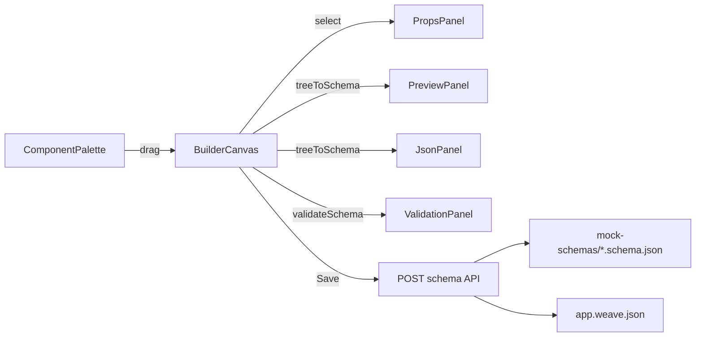

# Weavo Playground (Drag-and-Drop Builder)

The Playground is a visual, drag-and-drop builder for Weavo schemas. You assemble a UI from a component palette, edit properties, preview it live, and save it as a real `*.schema.json` page in the active weave. It reuses the same renderer and validator as the production app, so what you build is exactly what ships.

- **Route:** `#/playground` (also linked from the landing navbar)
- **Source:** `src/playground/`
- **Saves to:** `src/builder/mock-schemas/{schema-id}.schema.json` + `app.weave.json`

---

## Quick start

```bash
# Terminal 1 — API (required for Save / Load)
npm run serve        # http://localhost:3000

# Terminal 2 — app
npm run dev          # http://localhost:5173
```

Open `http://localhost:5173/#/playground`.

1. Drag components from the **Palette** (left) onto the **Canvas** (center).
2. Click a node to select it, then edit it under the **Properties** tab (right).
3. Watch the **Preview** tab render live; inspect the generated schema under the **JSON** tab.
4. Enter a `schema-id` and title in the toolbar, then **Save**.
5. Reload and open `#/{schema-id}` to view the saved page.

---

## UI layout

```
+------------------------------------------------------------------+
| Weavo Playground   [Load v] [schema-id] [Title]   Clear | Save  |
+----------+---------------------------+---------------------------+
| Palette  | Canvas (nestable nodes)   | [Preview | JSON | Props] |
| Layout   | [Section]                 |                          |
|  Section | |  [Button: Click]  x     |   live renderNode        |
|  Card    | |  [Input: Email]   x     |   output / JSON / fields |
| UI       |                           |                          |
|  Button  +---------------------------+                          |
|  ...     | Validation: errors/warns  |                          |
+----------+---------------------------+---------------------------+
```

- **Palette** — components grouped into **Layout**, **UI**, and **Text**.
- **Canvas** — drop, select, drag-reorder, nest into containers, and delete.
- **Validation bar** — live results from `validateSchema`.
- **Right panel** — tabbed: **Preview**, **JSON**, **Properties** (auto-opens when you select a node).

---

## Architecture



The Playground is a React tool, not a weave schema page. `SchemaRenderer` checks the hash and renders `<PlaygroundPage />` when the route is `#/playground`; otherwise it renders the active schema as usual.

---

## Module reference (`src/playground/`)

| File | Responsibility |
| ---- | -------------- |
| `PlaygroundPage.jsx` | Top-level shell. Owns the `DndContext`, drag handlers, live `treeToSchema` + `validateSchema` memos, and the tabbed right panel. Wraps everything in `BuilderProvider`. |
| `BuilderProvider.jsx` | Reducer-backed state: `nodes` (tree) + `selectedId`, with actions `addNode`, `moveNode`, `deleteNode`, `updateProps`, `updateText`, `select`, `load`, `clear`. Exposes `useBuilder()`. |
| `schema-tree.js` | The component `CATALOG`, `createNode`, immutable tree ops, and `treeToSchema` / `schemaToTree` conversions. |
| `ComponentPalette.jsx` | Renders the catalog as `@dnd-kit` draggables grouped by category. |
| `BuilderCanvas.jsx` | Recursive canvas. Each node is sortable; each container is a droppable zone (supports nesting). Handles select / delete / drag handle. |
| `PropsPanel.jsx` | Data-driven property editor generated from each catalog entry's `fields`, plus a text-content editor for text-capable nodes. |
| `PreviewPanel.jsx` | Live preview via `renderNode`, wrapped in an error boundary so invalid in-progress schemas never crash the page. |
| `JsonPanel.jsx` | Shows the generated JSON; edits can be applied back to the canvas via `load()`. |
| `PlaygroundToolbar.jsx` | Load existing schema, set `schema-id` + title, Clear, and Save (validates before posting). |
| `index.js` | Barrel exports (`PlaygroundPage`, `BuilderProvider`, `useBuilder`). |

Styling lives in `src/scss-core/playground.scss` (imported by `app.scss`) and uses existing design tokens.

---

## Node & schema model

### Internal builder node

```js
{
  id: "n_ab12cd34",     // builder-internal, stripped on export
  type: "Button",        // component or HTML tag
  props: { label: "Click", variant: "primary" },
  text: "Badge",         // optional string content (text-capable nodes)
  children: []           // present on container nodes
}
```

### Exported schema

The builder's top-level node list is wrapped into the conventional `Page > Main` structure:

```json
{
  "type": "Page",
  "children": [
    {
      "type": "Main",
      "children": [
        { "type": "Section", "props": { "direction": "column" }, "children": [
          { "type": "Button", "props": { "label": "Click", "variant": "primary" } }
        ]}
      ]
    }
  ]
}
```

`schemaToTree()` reverses this: it unwraps `Page > Main`, assigns fresh ids, and turns string children into a node's `text`, so saved schemas round-trip back into the editor.

---

## Component catalog

Defined in `schema-tree.js` as `CATALOG`. Each entry drives both the palette and the Properties panel.

| Group | Components |
| ----- | ---------- |
| **Layout** | `Section`, `Container`, `Header`, `Footer`, `Card` (all containers) |
| **UI** | `Button`, `Input`, `Badge`, `Spinner`, `ProgressBar` |
| **Text** | `h1`, `h2`, `p` |

Each catalog entry:

```js
{
  type: "Button",
  label: "Button",
  group: "UI",
  defaultProps: { label: "Button", variant: "primary" },
  // isContainer: true,   // renders a nested drop zone
  // allowText: true,     // shows a "Text content" editor
  // defaultText: "...",
  fields: [
    { key: "label", label: "Label", type: "text" },
    { key: "variant", label: "Variant", type: "select",
      options: ["primary", "secondary", "default", "success", "danger"] },
    { key: "size", label: "Size", type: "select", options: ["", "sm", "lg"] }
  ]
}
```

`fields[].type` supports `text`, `number`, and `select` (with `options`). Empty-string prop values are dropped on update to keep the exported schema clean.

### Adding a new component to the palette

1. Ensure the component is registered in `ComponentMap` (`src/components/index.jsx`) and known to `validate-schema.js`.
2. Append an entry to `CATALOG` in `schema-tree.js` with `type`, `label`, `group`, optional `defaultProps` / `isContainer` / `allowText`, and `fields`.

No other changes are needed — the palette, props panel, preview, and validator pick it up automatically.

---

## Drag-and-drop behavior

Built on `@dnd-kit/core` + `@dnd-kit/sortable` + `@dnd-kit/utilities`.

- **Palette items** are draggables carrying `{ source: "palette", nodeType }`.
- **Canvas nodes** are sortable, carrying `{ source: "node", nodeId, nodeType, parentId, index }`.
- **Containers** (root + each container node) are droppable zones carrying `{ source: "container", containerId }`.

On drop (`PlaygroundPage.handleDragEnd`):

- From **palette** → `addNode(nodeType, containerId, index)`.
- From **canvas** → `moveNode(nodeId, containerId, index)`, with guards preventing a node from being dropped onto itself or into its own subtree.

The drop target resolves to the hovered container (append) or the hovered node's parent + index (insert before).

---

## Validation & preview

- **Validation** runs live via `validateSchema` (re-exported from the renderer) and is shown in the bar under the canvas as `errors[]` / `warnings[]`, or a green "Schema is valid".
- **Preview** uses the real `renderNode` inside an error boundary. Empty canvases show a placeholder; render-time errors show an inline message instead of crashing.
- **JSON** can be hand-edited and applied back to the canvas; invalid JSON shows an inline error and does not affect the tree.

---

## Save / Load (server-backed)

### Save

The toolbar **Save** validates the schema, then calls:

```
POST /api/weavo.weave/:weaveId/schema
Content-Type: application/json

{ "schemaId": "my-page", "title": "My Page", "schema": { ...Page schema... } }
```

Server (`src/server.js` → `src/server/weave-store.js::saveSchema`):

1. Validates `schemaId` (lowercase letters, numbers, dashes) and basic schema shape.
2. Writes `src/builder/mock-schemas/{schemaId}.schema.json`.
3. Adds/updates `schemas[schemaId] = { title, file }` in `app.weave.json`.
4. Invalidates the in-memory weave cache.
5. Returns `{ schemaId, title, file }`.

Client helper: `saveSchema(weaveId, { schemaId, title, schema })` in `src/weave/fetchWeave.js`.

> The Express server (`npm run serve`) must be running. After a save, reload the app to pick up the new schema, then open `#/{schema-id}`.

### Load

The toolbar's **Load schema…** dropdown lists every schema in the current weave (including ones you've saved). Selecting one calls `load(schema)`, which converts it back into editable canvas nodes via `schemaToTree()`.

---

## Files touched outside `src/playground/`

| File | Change |
| ---- | ------ |
| `src/weave/hash-routing.js` | `isPlaygroundRoute()` + `PLAYGROUND_ROUTE` |
| `src/weave/SchemaRenderer.jsx` | Renders `<PlaygroundPage />` on the playground route (hash listener) |
| `src/weave/fetchWeave.js` | `saveSchema()` client function |
| `src/weave/index.js` | Re-exports `saveSchema`, `isPlaygroundRoute`, `PLAYGROUND_ROUTE` |
| `src/server/weave-store.js` | `saveSchema()` + cache invalidation |
| `src/server.js` | `POST /api/weavo.weave/:weaveId/schema` endpoint |
| `src/builder/mock-schemas/landing.schema.json` | Navbar link to `#/playground` |
| `src/scss-core/app.scss` | Imports `playground.scss` |
| `package.json` | Adds `@dnd-kit/core`, `@dnd-kit/sortable`, `@dnd-kit/utilities` |

---

## Keyboard & interaction notes

- Click a node to select it (auto-switches the right panel to **Properties**).
- Click empty canvas to deselect.
- Drag handle (`⠿`) on each node initiates drag; the `×` button deletes it.
- A 4px pointer activation distance prevents accidental drags when clicking.

---

## Known limitations / next steps

- **No live weave refresh after save** — reload to see a newly saved schema in routing.
- **No undo/redo** or node duplication yet.
- **No file import/export** (only server save/load).
- **Reorder within a container** uses remove-then-insert, which can be off by one when moving downward in the same list; cross-container moves and palette adds are exact.
- Auth is not enforced on Save (dev-friendly); gate behind `isLoggedIn` from `WeaveProvider` if needed.
